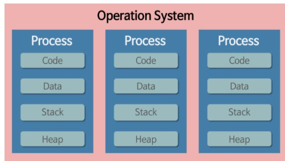
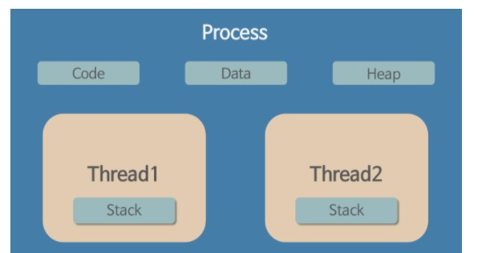

:octocat: Threads vs Processes
=================================================

#

## 1. Process(프로세스)

> 정의 : 운영체제로부터 자원을 할당받은 작업의 단위 
- 컴퓨터에서 연속적으로 실행되고 있는 프로그램
- 메모리에 올라와 실행되고 있는 프로그램의 인스턴스. 
- 구성 : 코드영역(code), 데이터 영역(date), 스택 영역(stack), 힙영역(heap)
- 멀티 프로세스 : 두개 이상의 프로세스가 실행되는 것

#

## 2. Thread(스레드)

> 프로세스가 할당받은 자원을 이용하는 실행 흐름의 단위 
- 한 프로세스 내에서 동작되는 여러 실행의 흐름으로 프로세스 하나에 자원을 공유하면서 일련의 과정 여러개를 동시에 실행시킬 수 있는 것. 
- 스레드는 프로세스 안에 포함되어 있다. 
- 스레드는 프로세스 내에서 각각 Stack만 따로 할당받고, Code, Data, Heap 영역은 공유한다. 
- 각각의 스레드는 별도의 레지스터와 스택을 갖고 있지만, 힙 메모리는 로 읽고 쓸 수 있다. 
- 멀티 스레드: 하나의 프로세스가 여러 작업을 여러 스레드를 사용하여 동시에 처리하는 것.

> JAVA에서의 스레드 
- java는 어떤 프로그램을 만들던지 기본적으로 하나의 쓰레드가 제공되며 이 쓰레드에 의해 프로그램이 실행됨. 
- JVM(java.exe)에 의해 하나의 프로세스가 발생하고 main() 안의 실행문 들이 하나의 스레드이다. 
- main() 이외의 또 다른 스레드를 만들려면 Thread 클래스를 상속하거나 Runnable 인터페이스를 구현하면 된다. 
- 일반 스레드와 거의 차이가 없다. 
- 자바에는 프로세스가 존재하지 않고 스레드만 존재하며, 자바 스레드는 JVM에 의해 스케줄되는 실행 단위 코드 불록이다. 
- 자바에서 스레드 스케줄링은 전적으로 JVM에 의해 이루어진다 
- 아래와 같은 스레드와 관련된 정보들도 JVM이 관리한다 
    - 스레드가 몇 개 존재하는 지 
    - 스레드로 실행되는 프로그램 코드의 메모리 위치는 어디인지 
    - 스레드의 상태는 무엇인지 
    - 스레드의 우선순위는 얼마인지

#

## 3. Process와 Thread 차이 
> 1) 
- 운영체제가 프로세스마다 각각 독립된 메모리 영역을 Code,Data,Stack,Heap의 형식으로 할당해 주기 때문에 프로세스는 다른 프로세스의 변수나 자료에 접근할 수 없다. 

- 반면, 스레드는 메모리를 서로 공유할 수 있음.
    - 프로세스가 할당받은 메모리 영역 내에서 Stack 형식으로 할당된 메모리 영역은 따로 할당받고, 나머지 Code/Data/Heap 형식으로 할당된 메모리 영역을 공유한다. 따라서 각각의 스레든느 별도의 스텍을 가지고 있지만 힙 메모리는 서로 읽고 쓸 수 있게 된다. 

> 2) 
- 프로세스는 오류 발생으로 인해 강제로 종료될 시, 다른 프로세스는 영향을 받지 않음. 
- 스레드는 Code/Data/Heap 메모리 영역의 내용을 공유하기 때문에 어떤 스레드 하나에서 오류가 발생한다면 같은 프로세스 내의 다른 스레드 모두가 강제로 종료. 

## 4. 참고 자료 및 추천 영상

https://www.youtube.com/watch?v=PXN8gpZ5OEg

https://velog.io/@raejoonee/%ED%94%84%EB%A1%9C%EC%84%B8%EC%8A%A4%EC%99%80-%EC%8A%A4%EB%A0%88%EB%93%9C%EC%9D%98-%EC%B0%A8%EC%9D%B4

https://www.geeksforgeeks.org/difference-between-process-and-thread/

